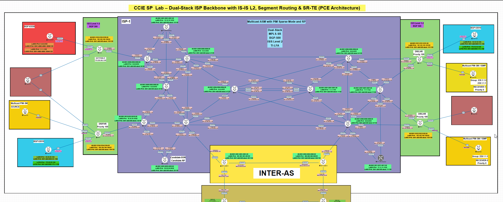
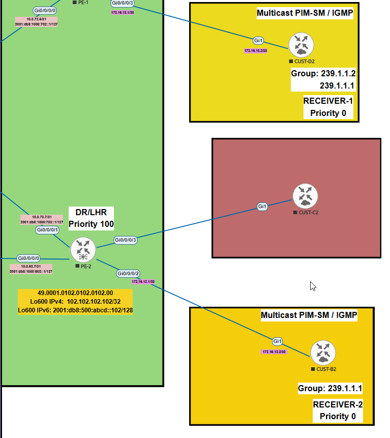
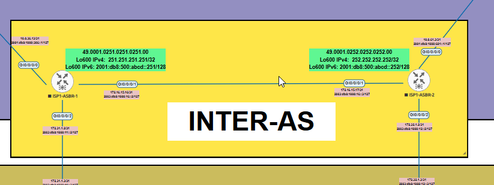
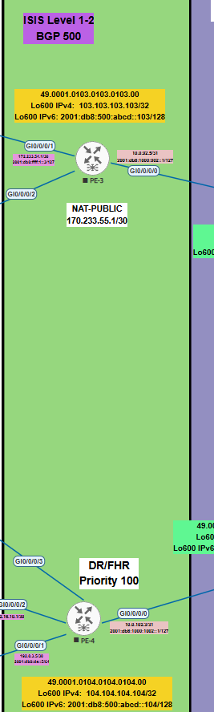
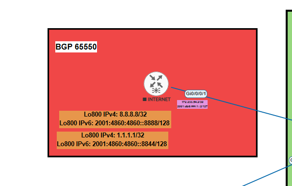
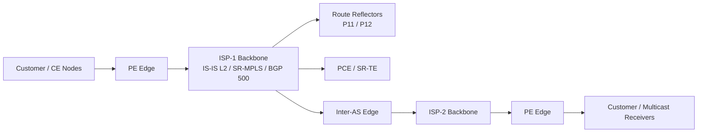

# CCIE SP NetOps Automation

[](#requirements)
[](#requirements)
[](#change-flow)
[](#eve-ng-node-profiles)
[](#lab-at-a-glance)

Standalone automation repository for a CCIE Service Provider lab running Cisco IOS XR.

This repository keeps NetOps automation separate from the website. The website can keep serving lab configs as a documentation library, while CI/CD, validation, templates, and deployment workflows live here.

## Lab at a Glance

This lab models a dual-stack service provider backbone with IS-IS L2, Segment Routing, SR-TE with PCE/PCC, VPNv4/VPNv6 services, multicast, and inter-AS connectivity.

| Domain | Scope |
| --- | --- |
| ISP-1 | 27 devices in the EVE-NG design |
| ISP-2 | 19 devices in the EVE-NG design |
| Core protocols | IS-IS Level 2, BGP AS 500, MPLS Segment Routing |
| Services | L3VPN VRFs, VPNv4/VPNv6, multicast ASM/PIM-SM, Inter-AS |
| Automation scope | Offline config parsing, topology facts, Jinja2 rendering, Ansible deployment, pyATS validation |

## Lab Visuals



| ISP and customer edges | Inter-AS and external connectivity |
| --- | --- |
|  |  |
|  |  |

Current `full-configs` snapshots can be parsed offline to generate device facts, topology edges, an Ansible inventory, and a Mermaid topology view.



## Requirements

| Requirement | Purpose |
| --- | --- |
| Python 3.12+ | Local scripts, config parsing, validation, and rendering |
| Jinja2 + PyYAML | Template rendering and YAML change data validation |
| Ansible Core | Dry-run, deployment, and post-validation workflows |
| `cisco.iosxr` collection | IOS XR device automation |
| `ansible.netcommon` collection | Network connection plugins |
| pyATS + Genie | BGP, IS-IS, VPNv4/VPNv6 validation |
| EVE-NG or CML | Local lab execution environment |

Install the Python dependencies with:

```powershell
python -m pip install -r .\automation\requirements.txt
```

Install pyATS only on the runner or workstation that performs live validation:

```powershell
python -m pip install -r .\automation\requirements-pyats.txt
```

Install Ansible collections:

```powershell
ansible-galaxy collection install -r .\automation\requirements.yml
```

## EVE-NG Node Profiles

| Role | Image | RAM | Ethernet Interfaces | QEMU NIC |
| --- | --- | ---: | ---: | --- |
| SP routers / P / PE / RR / PCE | `xrv-K9-demo-6.3.1` | 3072 MB | 10 | `virtio-net-pci` |
| Customer routers / CE | `csr1000vng-universalk9.17.03.08.a-serial` | 4096 MB | 8 | `virtio-net-pci` |

## Structure

```text
.github/workflows/       GitHub Actions pipelines
automation/              Scripts, templates, Ansible, pyATS, and evidence
full-configs/            Baseline lab configs
```

## Included Workflows

- Offline lab visibility from `full-configs`.
- Generated facts, Ansible inventory, topology edge CSV, and Mermaid diagram.
- Standard workflow for adding a new VRF across multiple PEs.
- Jinja2 templates for IOS XR: VRF, ISIS/SR, and iBGP with route reflectors.
- Ansible playbooks for rendering, dry-run, CML/EVE-NG, production, and post-validation.
- pyATS skeleton for validating BGP, ISIS, VPNv4, and VPNv6.
- GitHub Actions pipeline and GitLab CI example.

## Local Usage

```powershell
python .\automation\scripts\build_lab_facts.py
python .\automation\scripts\validate_lab_facts.py
python .\automation\scripts\validate_change_data.py
python .\automation\scripts\render_change.py
python .\automation\scripts\validate_rendered_config.py
```

## Change Flow

```text
Engineer creates branch
        |
Modify YAML change data and Jinja2 template
        |
Commit / Pull Request
        |
Validate YAML
        |
Validate rendered IOS XR config
        |
Dry-run --check --diff
        |
Deploy to CML/EVE-NG
        |
pyATS validates BGP, ISIS, VPNv4, VPNv6
        |
Manual approval
        |
Deploy to production
        |
Post-validation
        |
Evidence attached to CRQ
```

## Note

Generated files under `automation/generated`, `automation/rendered`, and `automation/evidence` are ignored by git except for their `.gitignore` placeholders.
